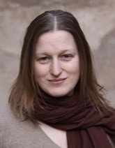

# Biography
 * Postdoctoral Fellow, Department of Biological Sciences & Eck Institute for Global Health, University of Notre Dame, USA  2018 - Present
 * PhD, Swiss Tropical and Public Health Institute, Switzerland  2018
 * M.Sc. Computer Science, University of Basel, Switzerland 2008
 * B.Sc. Bioinformatics, University of Basel, Switzerland 2006

# Projects
 * [HaplotypR](https://lerch-a.github.io/HaplotypR)

# Publications
  * Gruenberg, M., Lerch, A., Beck, H. & Felger, I. Amplicon deep sequencing improves Plasmodium falciparum genotyping in clinical trials of antimalarial drugs. Sci. Rep. 1–12 (2019). http://dx.doi:10.1038/s41598-019-54203-0.
  * Lerch, A. et al. Longitudinal tracking and quantification of individual Plasmodium falciparum clones in complex infections. Sci. Rep. 9, 3333 (2019), http://dx.doi.org/10.1038/s41598-019-39656-7.
  * Lerch, A. et al. Development Of Amplicon Deep Sequencing Markers And Data Analysis Pipeline For Genotyping Multi-Clonal Malaria Infections. BMC Genomics (2017), 18(1), p.864, http://dx.doi.org/10.1186/s12864-017-4260-y.
